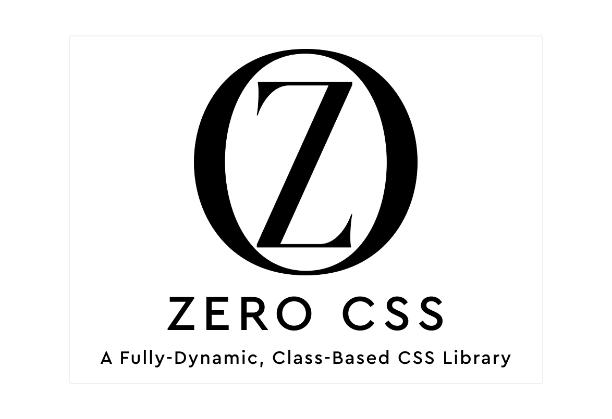

# <p align="center">ZERO CSS - A fully-dynamic, class-based CSS library</p>

<div align="center"></div>

Introducing `ZERO CSS`, the most advanced and groundbreaking CSS library ever conceived. `ZERO CSS` redefines the boundaries of what a CSS library can be. Unlike traditional libraries, `ZERO CSS` `doesn't rely on pre-defined classes`. Instead, every `class is dynamically generated on the client side`, in real-time, as developers apply them to HTML elements.

This innovative approach empowers developers with unparalleled flexibility and performance, creating a truly on-demand styling experience. By shifting CSS generation to the client-side, `ZERO CSS` unlocks capabilities that no other library can match.

`ZERO CSS` is not just a tool — it's a `paradigm shift in CSS development`, comparable to the transformation React brought to JavaScript. Its instant adaptability and real-time styling power deliver performance and versatility that traditional libraries simply cannot replicate, pushing the boundaries of what’s possible in modern web development.

## The Unmatched Superpowers of ZERO CSS: How It Stands Above All Other Libraries

### `ZERO CSS` is the epitome of true dynamism

  While other libraries might define `dynamic` within rigid boundaries, `ZERO CSS` shatters those limitations. Here, `dynamic` means `absolute freedom` — the ability to apply any value to any property, without constraints.

  > Example: Whether it's `wd-10%`, `wd-12.5vw`, `border_rad-2.4vw+2.4%+10px+2rem`, or `color-red`, developers can seamlessly use any unit — `px, rem, em, %, vw, vh` — with any value, from decimals like `1.2` and `11.56` to more complex combinations(with the upcoming updates).

  Sure, other libraries may claim to support flexibility, but they require pre-definition in a config file, limiting developers to a pre-set range of values. What they call `dynamic` is just controlled variability — it’s far from the real-time, unrestricted power that `ZERO CSS` delivers.

  With `ZERO CSS`, **there are no predefined limits. It’s not just flexible—it’s truly `dynamic`**.

### Set Your Own Standards to provide a Truly Customized Web Experience

  CSS variables are one of the most powerful tools in modern web design, offering unparalleled flexibility to customize a website’s look and feel. Traditionally, developers must manually define these variables, but `ZERO CSS` takes this to a whole new level, making customization seamless and intuitive.

  Unlike other libraries, which don't even offer the ability to create your own CSS variables, `ZERO CSS` empowers developers to define them effortlessly. With `ZERO CSS`, you don’t even need to know how CSS variables work.

  With `ZERO CSS` developers can create CSS variables in one of the following two ways:

  1. **using utility class:**<br>

  The CSS class that lets developer create new CSS variables, looks like `vars_[selector]-[max/min]_[breakPoints]@var1:val,var2:val,.....`.
  The class must start with `vars` and the `[selector]` is a placeholder - that can be replaced with different selectors like - `html`, `:root`, `.class_name`,
  `#id` or anything that is a valid CSS selector. The name of variables should be camelCased i.e. `primaryClr` and that will be added as `--primary-clr` and after the `:` provide the suitable value which must not contain any space.

  > Example

  ```html
   <body class="vars_:root@flexDir:column&blue:blue&bgImg:url('https://cdn.pixabay.com/photo/2024/05/26/10/15/bird-8788491_1280.jpg')&textGrad:linear-gradient(90deg,rgba(2,0,36,1)0%,rgba(9,9,121,1)35%,rgba(0,212,255,1)100%)"></body> 
  ````

  this will be added to the CSS as

  ```css
  :root {
    --flex-dir: column;
    --blue: blue;
    --bg-img: url(https://cdn.pixabay.com/photo/2024/05/26/10/15/bird-8788491_1280.jpg);
    --text-grad: linear-gradient(90deg, rgba(2, 0, 36, 1) 0%, rgba(9, 9, 121, 1) 35%, rgba(0, 212, 255, 1) 100%);
  }
  ```

  2. **Using JavaScript Object:**<br>

  Developer has to create a JS object like the following and provide it the name `css_vari`(need to be exact).

```js
const css_vari = {
    generic: { // for the CSS variables that don't have any media queries. 
        html: { // provide the selector name 
            mainClr: "#345262",
            primaryClr: "#2345ef",
            borderRad: "10px",
        },
        ".some-class": {
            mainClr: "#345262",
            primaryClr: "#2345ef",
            borderRad: "10px",
        }
    },
    "500px": { // breakPoint value, for max-width, you can omit the max.
        ":root": {
            borderRad: "5px",
            blur: "2px",
        }
    },
    "min_300px": {
        ":root": {
            borderRad: "10px",
            blur: "2px",
            bgClr: "#234567"
        }
    }
}
```

In CSS this will added in the following manner:

```css
html {
 --main-clr: #345262;
 --primary-clr: #2345ef;
 --border-rad: 10px;
}
.some-class {
 --main-clr: #345262;
 --primary-clr: #2345ef;
 --border-rad: 10px;
 --main-clr: #345262;
 --primary-clr: #2345ef;
 --border-rad: 10px;
}
@media (max-width: 500px) {
  :root {
 --border-rad: 5px;
 --blur: 2px;
  }
}

@media (min-width: 300px) {
  :root {
 --border-rad: 10px;
 --blur: 2px;
 --bg-clr: #234567;
  }
}
```

With `ZERO CSS`, setting **your own standards is easier, faster, and more powerful than ever before—delivering a next-level customization experience unmatched by any other library**.

### It's not tiny, It's NULL

  Unlike traditional CSS libraries that come bloated with pre-defined classes and rely on purging unused styles after the fact, `ZERO CSS` takes a revolutionary approach. Instead of generating a separate CSS file, `ZERO CSS` dynamically creates all classes at runtime. This means there’s nothing to purge—ever.

  By adhering to the DRY (Don't Repeat Yourself) principle at its core, `ZERO CSS` ensures that no CSS class is redundantly generated or evaluated more than once. **Every class is unique, and no code duplication occurs**.

  The real power of this approach? No CSS file is ever shipped across the network. Traditional libraries may boast of tiny, purged CSS files, but with `ZERO CSS`, there’s no file at all—it's fully dynamic. This leads to drastically improved site performance, as no bandwidth is wasted on delivering or caching static CSS files.

  With `ZERO CSS`, **you unlock the next level of CSS optimization: zero redundancy, zero purging, zero files—delivering a leaner, faster web experience**.

### Effortless, Pixel-Perfect Adaptation for Every Screen Size

As developers, we all strive to create visually stunning websites that seamlessly adapt to any device, regardless of screen size. Achieving this requires the strategic use of media queries with precise min and max-width conditions. While standard breakpoints are a solid foundation, unique screen sizes often demand special attention:

```js
breakPoints = { // normal breaking point list available in `ZERO CSS`
  "xxl": "1500px",
  "xl": "1250px",
  "l": "1024px",
  "md": "768px",
  "s": "425px",
  "xs": "375px",
  "xxs": "320px"
};
```

But what happens when your design vision extends beyond these standard sizes? With `ZERO CSS`, styling custom breakpoints feels as natural as using predefined ones, unlocking unparalleled creative freedom.

> Example

```html
<!-- The Magic in Action -->
<div class="wd-xl-23rem wd-550px-15rem">Going for break-points that are not common screen sizes</div>
```

Simply swap in your desired screen width, and you're set. No additional configuration—just seamless, custom responsive design.

With `ZERO CSS`, developers can push the boundaries and fine-tune their designs for every imaginable screen size, showcasing their skills without breaking a sweat. It's not just a solution; it's the key to unlocking your responsive design potential.

### Unleash the Power of Flexbox and Grid

Every game-changer has that one standout feature that sets it apart, transforming complex tasks into elegant solutions. For CSS, that revolution came with the introduction of `Flexbox` and `Grid`. These technologies empowered developers to craft layouts that were once considered impossible.

With `ZERO CSS`, we take that power further, creating a suite of custom classes that make working with Flexbox and Grid intuitive, streamlined, and effortlessly powerful. Say goodbye to verbose code and hello to concise, readable styling that brings your design visions to life.

> Example

**The Magic of Custom Classes:** <br>

1. `d-[max/min]_[breakpoint]-(flex/grid)&[flexDir:val]&justify:val&align:val&gap:val`:

This all-in-one class replaces lengthy CSS blocks, allowing you to define complex layouts with a single, intuitive line

```css
/* exact class in the following example d-flex&flexDir:column&justify:center&align:end&gap:3rem */
.interesting_selector {
  display: flex; /* or grid */
  flex-direction: column;
  justify-content: center; /* for grid this will be `justify-items` */
  align-items: end;
  gap: 3rem;
}
```

2. `flex_child-[max/min]_[breakpoint]-even`: <br>

Achieve equal-width child elements with ease, eliminating the need for additional tweaks and calculations. Flex your layout muscles without breaking a sweat.

3. `grid_col-[max/min]_[breakpoint]-(autoFill/autoFit)+val(vw/vh/px/rem)`: <br>

Create stunning, responsive gallery views for any screen size in an instant. Just one class sets the stage for a layout that's both adaptive and visually compelling. The result?

```css
/* exact class in the following example `grid_col-autoFit+10rem` */
  grid-template-columns: repeat(auto-fit, minmax(10rem, 1fr));
```

**Say Goodbye to Layout Frustrations**

Crafting layouts can be challenging, but implementing them shouldn’t be. With `ZERO CSS`, developers unlock the ability to create visually engaging, responsive layouts effortlessly. It’s not just about simplifying code—it’s about redefining how you build and style for the modern web.

### Craft Custom Classes to Keep Your Code DRY and Stylish

Staying DRY isn’t just smart—it’s the essence of coding with style. Imagine this: your design calls for the same set of classes across 20 different elements. Instead of tediously applying them one by one, wouldn’t it be better to group them into a single reusable class?<br>
Introducing `Class combinator` in `ZERO CSS` — a game-changing feature that lets you streamline your code effortlessly.

> Example

  let's assume that one using the following set of classes multiple times:

  `color-#fff`, `font-s:10px`, `pos-absolute`, `bottom-2%`, `left-2%`

  with `ZERO CSS` what the developer can do instead

  `__.unique_class-name@color-#fff,font-s:10px,pos-absolute,bottom-2%,left-2%` (exact implementation details will be discussed later)
  and apply the `unique_class-name` -- class to all the elements.

**Simplicity at Its Best**

With `ZERO CSS`, developers break free from the monotony of repetition, staying true to the DRY principle without even thinking about it. Elevate your code, maximize efficiency, and keep your styling sharp and consistent. It's not just a feature—it’s your key to more creative and maintainable code.

### Full Selector & Combinator Integration for True Creative Freedom

CSS selectors and combinators have long been the tools of choice for pros, unlocking creative power that makes CSS shine. Yet, no CSS library has embraced this potential—until now.

With `ZERO CSS`, using advanced selectors and combinators is as effortless as any other utility class. We’re bringing CSS back to its coolest roots, giving developers unmatched creative freedom to style their projects with precision.

Example
Want to apply styles based on sibling elements? Here's how you can achieve this with `ZERO CSS`:

- Traditional CSS:

```css
h2:has(+ p, + ul.red) {
  font-style: italic;
}
```

- With `ZERO CSS`:

```html
<section class="__h2:has(+p,+ul.red)@font-st:italic">
  <h2 >Title with Sibling Paragraph</h2>
  <p>This paragraph immediately follows the h2.</p>

  <h2>Title with Sibling List</h2>
  <ul class="red">
    <li>Item 1</li>
    <li>Item 2</li>
  </ul>
</section>
```

Now, let’s make CSS cool again. With `ZERO CSS`, selectors and combinators are no longer just features—they’re the keys to your most creative, powerful designs.

### Unlock the power of each and every Pseudo classes and elements

Most CSS libraries hold back, offering only the basics when it comes to pseudo-classes and elements. They give you just enough to get by, but why stop there?<br> 
With `ZERO CSS`, you’re unchained from those limits! Get direct access to every pseudo-class and pseudo-element, even the rare ones, to style like a CSS powerhouse. And don’t worry—just because it’s advanced doesn’t mean it’s complex. We keep it as simple as any other utility class, putting limitless styling power at your fingertips.

> Here’s What Freedom Looks Like:

Instead of classic CSS like:

```css
.menu-item:hover > .submenu {
  opacity: 1;
}
```

Imagine using `ZERO CSS` to write it as easily as:

```html

<div class="__.menu-item:hover>.submenu@opacity-1"></div>

```

**Effortlessly, intuitively, and without limitations.**
**Unleash Your Inner CSS Visionary**

With `ZERO CSS`, you’re not bound by the usual rules. Go beyond the basics and explore the full scope of pseudo-classes and elements in your own creative style. Transform your ideas directly into styling—no limitations, no hurdles. Just pure, unfettered CSS power.

### Stack multiple Backgrounds & Shadows & Clip-path

Ever felt the frustration of being limited by CSS libraries that don’t support complex, stacked properties? Backgrounds, shadows, clip-paths—stacking them can be a game-changer, but most libraries just can’t handle it.

With `ZERO CSS`, those limits are gone. Create stunning, layered effects that would normally require dozens of lines of code, in a single class. Add multiple backgrounds, layered shadows, and even complex clip-paths (coming soon!) with the same ease as any other styling.

> Example:

**Traditional CSS**

```css
.some-selector{
  background: 
  url('image1.jpg') no-repeat center center / cover,
  url('image2.png') repeat-x bottom / contain,
  linear-gradient(to right, rgba(255, 0, 0, 0.5), rgba(0, 0, 255, 0.5));
}
```

**With `ZERO CSS`:** (exact implementation details will discussed later)

```html
<div class="vars_html@linGrad:linear-gradient(to+right,rgba(255,0,0,0.5),rgba(0,0,255,0.5)) bg-size:cover&img:url@image1.jpg&pos:center+center&re:noRepeat,s:contain&img:url@image2.png&pos:bottom&re:repeatX,img:vLinGrad"></div>

```

**Imagine the Possibilities**

Forget the constraints—`ZERO CSS` lets you stack any and every background, shadow, and soon even clip-paths, giving you a level of control usually reserved for advanced CSS.

With `ZERO CSS`, the only limit is your creativity. Start stacking, start styling, and take control like never before!

### Elevate Your Typography: Simple Online Font Importing

Every website has its own unique tone, vibe, and personality. And let’s face it—fonts play a massive role in setting that tone. Yet, most CSS libraries only offer a small, selective font list, leaving developers boxed into choices that may not truly reflect their site’s personality.

But with `ZERO CSS`, it’s a whole new world! Adding any font is as easy as adding a class. No limits, no compromises—just pure creative freedom to use any font you can dream of.

> Example

**Traditional CSS Import**

```css

@import url('https://fonts.googleapis.com/css2?family=Doto:wght@100..900&family=Open+Sans:ital,wght@0,300..800;1,300..800&display=swap');

```

**with ``ZERO CSS``**

```html

<div class="@import-https://fonts.googleapis.com/css2?family=Doto:wght@100..900&family=Open+Sans:ital,wght@0,300..800;1,300..800&display=swap"></div>

```

**Stand Out with Your Font Choices**

Don’t settle for “close enough”—*express your site’s personality in full*. With `ZERO CSS`, the perfect font is always just a class away. It’s time to make your website’s vibe truly one of a kind!

## ZERO CSS: Revolutionize Your Styling Experience – Pure Creativity, No Limits!

 SO, with `ZERO CSS`, we are rewriting the rules. Step into the new era of styling where classes are generated dynamically as you write HTML—no predefined classes, no CSS file, no limits.<br>
 It’s pure, client-side magic, redefining **“dynamic”** to mean absolute creative freedom. **Flexibility?** Check. **Full control over every property, unit, and even pseudo-elements?** Done. Custom media queries, stacked backgrounds, instant font imports, and an intuitive utility-first design put power back in your hands.<br>
 `ZERO CSS` isn’t just efficient; it’s transformative—creating a shift in CSS as groundbreaking as React’s impact on JavaScript. Dive in and style without limits!

## Rules before use start using this awesome Library

### How to follow the following manual

- if somethings are within `[]` ==> that value is optional.
- if somethings are within `{}` ==> any or all of the value can be used.
- if somethings are within `()` ==> only one of the value can be used.

### Some common rules for all the classes

- any and every length units can be used like `px, rem, em, %, vw, vh`.

>Example: wd-500px-2rem, bg_color-#342ad2 etc.

- `imp` is used to make a property as `!important`.

>Example: wd-500px-2rem_imp or d-flex_imp etc.

- there must not be any space within a className.

- to use `space` use `+` instead while providing a value.

>Example: m-20px+20px+10px+2rem

- `kebabCase` should be replaced by `camelCase` while providing a value.

>Example: justify_content-spaceBetween or bg_repeat-noRepeat etc.

- to provide a `negative value` - start the value with a `n`.

>Example: m-n20px.

- to define a `CSS variable` use `camelCase`.

>Example: the CSS variable should be `--input-box-padding`, then you have to use the name as `inputBoxPadding`.

- to make a value a `CSS variable` - start the value with `v` and next letter must be capitalised.

>Example: p-vInputBoxPadding => `--input-box-padding` is the CSS variable.

## Structure of the individual Class-name

Most class has exactly three parts each separated by `-`.

> <h2 align="center">property_identifier-media_query-value</h2>

1. **Property identifier**
2. **Media query part**<br>
This one has only two parts - `[max/min]_[breakpoint]`. Now, the `min or max` part is `optional` and if you don't mention it then it will be a `max-width` media query by default.
3. **Value part**

>Let's understand with an example: `max_wd-xl-20rem`
`max_wd` is the `property identifier part`.<br>
`xl` is the `media query` which translate into a `'max-width` media query.
`20rem` is the value part.

>above example is a simple one, let's try with a complex one <br> `bg-size:cover&img:url@image1.jpg&pos:center+center&re:noRepeat,s:contain&img:url@image2.png&pos:bottom&re:repeatX,img:vLinGrad`


## List of possible class name and How to use them

### Class name for size

- `[max/min]_(wd/ht/size)-[max/min]_[breakpoint]-value_[imp]`
- `aspect_ratio-[max/min]_[breakpoint]-value_[imp]`

### Class name for layout

-- **Display Classes**:

- `d-[max/min]_[breakpoint]-(block/inline/inline-block/flex/grid/none)`
- `d-[max/min]_[breakpoint]-(flex/grid)&[flexDir:val&justify:val&align:val&gap:val]`

-- **FLex Classes**:

- `flex-[max/min]_[breakpoint]-{grow_shrink_basis}`
- `flex_(dir/grow/shrink/wrap)-[max/min]_[breakpoint]-value`
- `flex_child-[max/min]_[breakpoint]-(even/fixed_wd/auto)`

-- **Grid Classes**:

- `grid-[max/min]_[breakpoint]-(col/row):Width&re:count&[gap/cGap/rGap]:value`
- `grid-[max/min]_[breakpoint]-(col/row):width1,width2,....`
- `grid-[max/min]_[breakpoint]-(col/row)Span:(to,from/value)`
- `grid-col_(auto-fit/auto-fill)_10(vw/vh/px/rem)`

-- **Justify Classes**:

- `justify_(content/items/self)-[max/min]_[breakpoint]-value`

-- **Align Classes**:

- `align_(content/items/self)-[max/min]_[breakpoint]-value`

-- **Gap Classes**:

- `[col/row]_gap_(content/items/self)-[max/min]_[breakpoint]-value`

-- **Order Classes**:

- `order-[max/min]_[breakpoint]-value`

-- **Position Classes**:

- `pos-[max/min]_[breakpoint]-value`

-- **overflow Classes**:

- `overflow-[max/min]_[breakpoint]-value`

-- **zIndex Classes**:

- `zIndex-[max/min]_[breakpoint]-value`

-- **top/right/bottom/left Classes**:

- `(top/right/bottom/left)-[max/min]_[breakpoint]-value`

-- **Center element Classes**:

- `center_el-[max/min]_[breakpoint]-(c/t/r/b/l)_(abs/fix)`
- `align_(left/right/top/bottom)-[max/min]_[breakpoint]-(abs/fix)_value`

### Spacing Classes

-- **Padding and Margin Classes**

- `(p/m)_[x/y/t/r/b/l]-[max/min]_[breakpoint]-value`
- `(p/m)-[max/min]_[breakpoint]-valueX_valueY`

### Border Classes

-- **Padding and Margin Classes**

- `border_[t/r/b/l]-[max/min]_[breakpoint]-{wd:val&st:va&clr:val}`
- `border_[t/r/b/l]_[wd/st/clr/off]-[max/min]_[breakpoint]-value`

- `border_rad_[tr/br/bl/tl]_[max/min]_[breakpoint]-value`

- `outline_[t/r/b/l]-[max/min]_[breakpoint]-{wd:val&st:va&clr:val&off:val}`
- `outline_[t/r/b/l]_[wd/st/clr/off]-[max/min]_[breakpoint]-value`

- `ring_[t/r/b/l]-[max/min]_[breakpoint]-{wd:val&clr:val}`

### Background Classes

-- **Background Classes**

- `bg-[max/min]_[breakpoint]-{clr:val&img:val&pos:val&s:val&re:val&org:val&clip:val&att:val}`
- `bg_(color/image/position/size/repeat/origin/clip/attachment)-[max/min]_[breakpoint]-value`

### Typography Classes

-- **Font Classes**

- `font-[max/min]_[breakpoint]-{st:val&weight:val&s:val&family:val}`
- `font_family-name-1,name-2,nameDifferent`
- `font_[style/weight/size]-[max/min]_[breakpoint]-value`

-- **Letter Classes**

- `letter_space-[max/min]_[breakpoint]-value`
- `letter_dir-[max/min]_[breakpoint]-value`

-- **Line Classes**

- `line_(height/clamp/break)-[max/min]_[breakpoint]-value`

-- **Text Classes**

- `txt_decor-[max/min]_[breakpoint]-type_color_style_thick`
- `txt_decor_[type/color/style/thick]-[max/min]_[breakpoint]-value`
- `txt_underline_offset-[max/min]_[breakpoint]-value`
- `txt_transform-value`

-- **Font color Class**

- `color-[max/min]_[breakpoint]-value`

-- **Font import Class**

- `@import-value`

### Effect Classes

-- **Filter and backdrop-filter Classes**

- `filter-[max/min]_[breakpoint]-{blur:val&brightness:val&dropShadow:val&....}`
- `filter_(blur/brightness/contrast/shadow/gray/hue/invert/sat/sepia/dropShadow)-[max/min]_[breakpoint]-value`
- `bdFilter-[max/min]_[breakpoint]-{blur:val&brightness:val&....}`
- `bdFilter_(blur/brightness/contrast/shadow/gray/hue/invert/sat/sepia)-[max/min]_[breakpoint]-value`

-- **Mix and Background Blend Classes**

- `(mix/bg)_blend-[max/min]_[breakpoint]-value`

-- **Opacity Classes**

- `opacity-[max/min]_[breakpoint]-value`

-- **Shadow Classes**

- `shadow-[max/min]_[breakpoint]-value`

-- **Text Gradient Classes**

- `text_grad-[max/min]_[breakpoint]-value`
